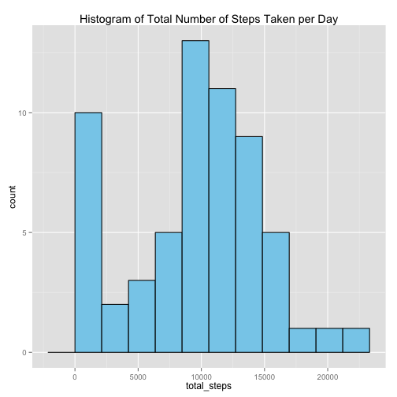
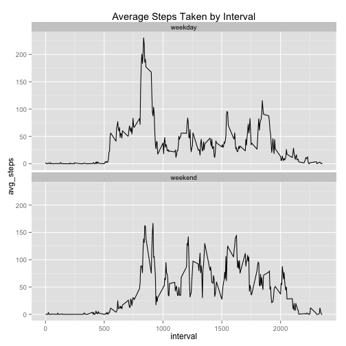

<<<<<<< HEAD
Analysis of Activity Monitoring Data of an Anonymous Individual
==================================================================
###Data is collected during the months of October and November, 2012

#Loading and preprocessing the data

```r
library(lubridate)
data<- read.csv('activity.csv',header = TRUE)
data$date <- ymd(data$date)
```

#1 What is mean total number of steps taken per day?
##1.1: Calculate the total number of steps taken per day

```r
library(dplyr)
total_steps_per_day <- group_by(data,date) %>% summarise(total_steps = sum(steps,na.rm=TRUE))
head(total_steps_per_day)
```

```
## Source: local data frame [6 x 2]
## 
##         date total_steps
## 1 2012-10-01           0
## 2 2012-10-02         126
## 3 2012-10-03       11352
## 4 2012-10-04       12116
## 5 2012-10-05       13294
## 6 2012-10-06       15420
```

##1.2: A histogram of the total number of steps taken each day

```r
library(ggplot2)
ggplot(data=total_steps_per_day,aes(total_steps))+
  geom_histogram(binwidth=with(total_steps_per_day,(max(total_steps)-min(total_steps))/10),
    color='black',fill='skyblue')+
  labs(title="Histogram of Total Number of Steps Taken per Day")
```

 

##1.3: Calculate Mean and Median of the total number of steps taken per day

```r
mean_total_steps <- mean(total_steps_per_day$total_steps)
median_total_steps <- median(total_steps_per_day$total_steps)
```
The mean of the total number of steps taken per day is 9354.2295082.
The median of the total number of steps taken per day is 10395.

#What is the average daily activity pattern?
##2.1: Time series plot of 5-min interval and the avg steps taken

```r
avg_steps_interval <- group_by(data,interval) %>% summarise(avg_steps = mean(steps,na.rm=TRUE))
ggplot(data=avg_steps_interval,aes(interval,avg_steps))+
  geom_line(color='black')+
  labs(title="Average Steps Taken by Interval")
```

 

##2.2: Which 5-min interval on average contains the maximum number of steps

```r
max_interval <- avg_steps_interval[with(avg_steps_interval,which(avg_steps == max(avg_steps))),1]
```
The 5-min interval of 835 contains the maximum average number of steps.

#Imputing missing values
##3.1: Numbers of row with NA

```r
na_row <- sum(is.na(data$steps))
```
The total number of 'NA' oberservation is 2304.

##3.2: Strategy to replace NA with 5-min interval average

```r
correct_na <- function(interval,input){
  if(is.na(input)){ 
    revised_step <- avg_steps_interval[which(avg_steps_interval$interval==interval),2]
    return(revised_step)
  }
  else{return(input)}
}
```

##3.3: Replace NA observations with 5-min interval average

```r
data$revised_step <- 0
 
for( i in 1 : length(data$steps)){
  data[i,4] <- correct_na(data[i,3],data[i,1])
}
```

##3.4: Make a histogram of the total revised number of steps taken each day

```r
total_revised_steps_per_day <- group_by(data,date) %>% summarise(total_revised_steps = sum(revised_step))
ggplot(data=total_revised_steps_per_day,aes(total_revised_steps))+
  geom_histogram(binwidth=with(total_revised_steps_per_day,(max(total_revised_steps)-min(total_revised_steps))/10),color='black',     fill='skyblue')+
  labs(title="Histogram of Total Number of Steps Taken per Day")
```

 

```r
mean_revised_total_steps <- mean(total_revised_steps_per_day$total_revised_steps)
median_revised_total_steps <- median(total_revised_steps_per_day$total_revised_steps)
```
The revised average of total steps is 1.0766189 &times; 10<sup>4</sup>, which is higher than the original average of 9354.2295082.

The revised median of total step is 1.0766189 &times; 10<sup>4</sup>, which is higher than the original median of 10395.

#Are there differences in activity patterns between weekdays and weekends?
##4.1: Create a new factor with two levels -"weekdays" and 'weekend'

```r
library(timeDate)
data$day <- as.factor(ifelse(isWeekday(data$date),"weekday","weekend"))
```

##4.2: A time series plot of the 5-minute interval (x-axis) and the average number of steps taken, averaged across all weekday days or weekend days

```r
avg_steps_day <- group_by(data,interval,day) %>% summarise(avg_steps = mean(revised_step))
ggplot(data=avg_steps_day,aes(interval,avg_steps))+
  geom_line(color='black')+
  facet_wrap(~day, nrow=2,ncol=1)+
  labs(title="Average Steps Taken by Interval")
```

 

=======
---
title: "Reproducible Research: Peer Assessment 1"
output: 
  html_document:
    keep_md: true
---


## Loading and preprocessing the data


## What is mean total number of steps taken per day?


## What is the average daily activity pattern?


## Imputing missing values


## Are there differences in activity patterns between weekdays and weekends?
>>>>>>> 80edf39c3bb508fee88e3394542f967dd3fd3270
